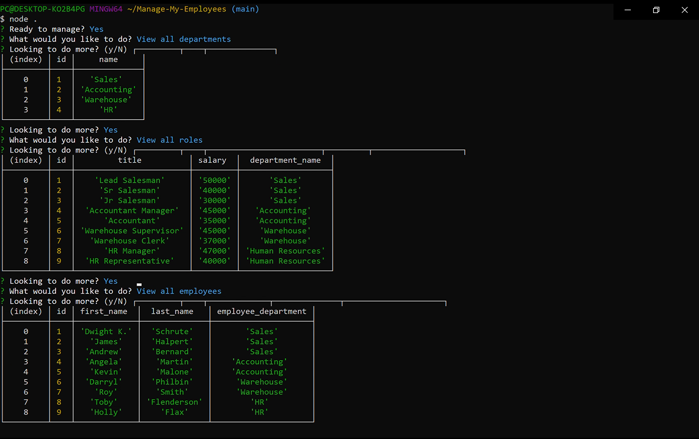

# Manage My Employees
## Description
  
- What was the motivation? To create a tool for management to more easily manage employee databases
- Why did I build this project? To build SQL skills
- What did I learn? How to manage databases and tables
  
## Table of Contents (Optional)
  
- [Installation](#installation)
- [Usage](#usage)
- [Credits](#credits)
- [License](#license)
- [Questions](#questions)
  
## Installation

Login to mysql > source db/db.sql > source db/schema.sql > source db/seeds.sql > then rune 'node index'

## Usage
  
Select 'Yes' after each prompt to continue moving along the app

Add a screenshot here:
  

  
## Credits
  
Collaborators: None 
  
## License
  
Unlicensed

## Questions
  
All questions and communications can be directed to:
Github: github.com/frivera14 

